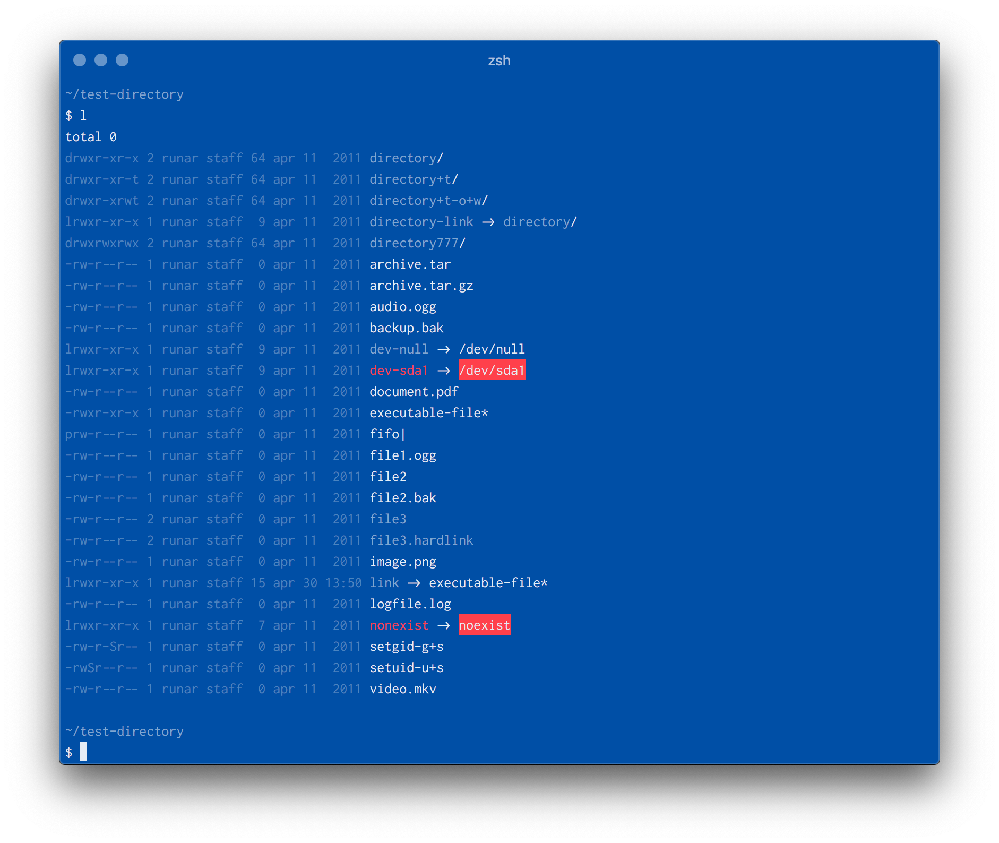

# blaakopi dircolors

This is a color scheme for dircolors, based on the [blaakopi] color palette.
Blaakopi is a simple color palette inspired by the old concept of blueprints.
It's minimalistic, very blue, and almost monochromatic, and certainly not for
everyone.

The screenshot above is captured in iTerm2 on MacOS, using the Inconsolata
font.

**Note:** Before using the blaakopi dircolors color scheme, make sure to set
your terminal emulator's color scheme to one of the following supported
terminal color schemes:

- [iTerm2](https://github.com/runar/blaakopi-iterm2)

## Usage

### Installation

Blaakopi dircolors is distributed as a database file for GNU dircolors, the
application that sets up colors for GNU ls.  To use this color scheme, download
the [`dircolors`](dircolors) file, then move or copy the file to `~/.dircolors`
and run the following command:

    eval `dircolors ~/.dircolors`

To automatically use this color scheme in all future sessions, add the above
command to your `.bashrc` or `.zshrc`.

### Notes regarding MacOS

MacOS ships with the BSD command line tools, and compared to the GNU
alternative they lack some features, including the ability to display colors.
To use this color scheme on MacOS, you should consider [installing the GNU
command line tools (coreutils)][coreutils] from homebrew.

## Contribution

Please post issues and bugs, feature requests and suggestions, and general
feedback in the [issue tracker].

[blaakopi]: https://github.com/runar/blaakopi
[issue tracker]: https://github.com/runar/blaakopi-dircolors/issues
[coreutils]: https://www.topbug.net/blog/2013/04/14/install-and-use-gnu-command-line-tools-in-mac-os-x/
